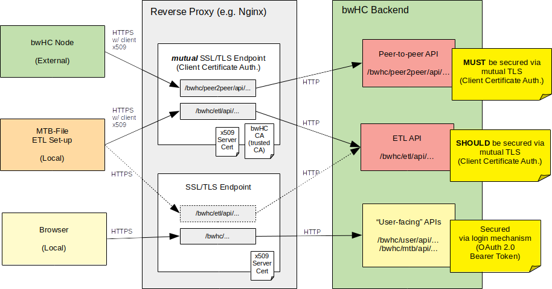
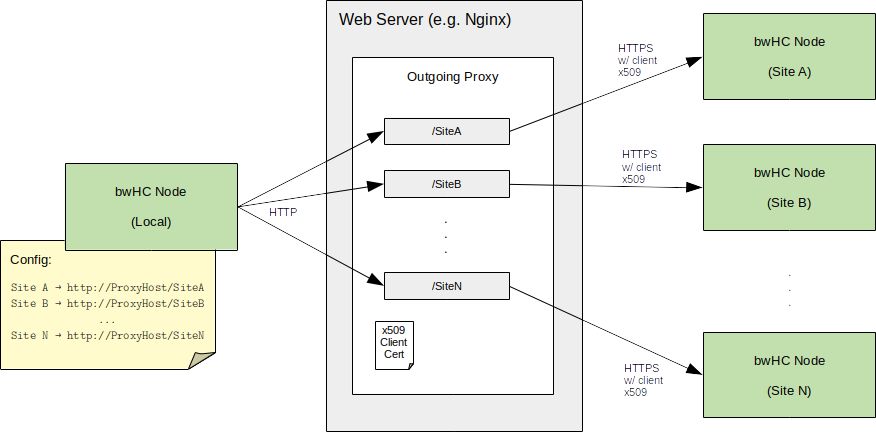

# bwHealthCloud Backend Manual


-----
## 1. Pre-requisites:

* Java Runtime Environment (e.g. OpenJDK)

* Nginx Web Server


-----
## 2. Installation:

* Unzip application package

* Change into unpacked application directory __bwhc-backend__

* Run installation script with target directory as parameter

```
foo@bar: unzip bwhc-backend.zip
...
foo@bar: cd bwhc-backend/
foo@bar: ./install.sh /path/to/target/dir
```

The target directory is created if non-existent.

The installation script copies all necessary files to the target directory.
In case that configuration files from a previous installation are already present, the previous files are __NOT__ overwritten.


--------
## 3. Configuration/Setup: 

--------
### 3.1 Basic Backend Application Configuration: 

The backend application is configured via environment variables defined in the script file __config__.

### 3.1.1 bwHC Backend Base Directory:

The path to the Backend application base directory is set with <code>BWHC_APP_DIR</code>.
By default, this variable will be set as the directory in which the __bwhc-backend-service__ script invocation occurs (pwd).
It can also be either overriden in __config__ or set in the command invoking the bwhc-backend-service script (see 4).

### 3.1.2 PID File:

The __process ID__ of the running backend application is written to a PID file configured in <code>PID_FILE</code>.
This defaults to <code>/tmp/bwhc-backend.pid</code> but can be overriden as desired.

### 3.1.3 Local Site and Persistence:

Configure the __local site name__ and the directories for __data storage__:

```bash
...
export ZPM_SITE=...               # TODO: Set local ZPM Site name

export BWHC_USER_DB_DIR=...       # ABSOLUTE path to dir where User Service stores data

export BWHC_DATA_ENTRY_DIR=...    # ABSOLUTE path to dir where Data Entry/Validation Service stores data

export BWHC_QUERY_DATA_DIR=...    # ABSOLUTE path to dir where Query/Reporting Service stores data
```

### 3.1.4 HGNC Catalog Management 

The bwHC application requires the HGNC catalog (in the TSV format as obtained from HUGO at https://ftp.ebi.ac.uk/pub/databases/genenames/hgnc/tsv/hgnc_complete_set.txt).
Given that this evolves rapidly, it has to be updated regularly in the bwHC app (current turnover period: 7 days).
The bwHC app has 2 strategies to obtain this catalog:

1) It will try to fetch it directly from the above URL and save it in the directory configured by environment variable <code>BWHC_HGNC_DIR</code>.
This requires that settings on the VM and IT environment allow for this external URL call.

2) If the HGNC catalog file is already present in the configured directory and not older than the turnover period (see above), it will be read directly.
The periodic update of the HGNC catalog can thus be set up alternatively with a cron job or similar.


-------
### 3.2 HTTP(S)/Communication Setup:

#### 3.2.1 Play Application HTTP Server:

By default, the Play HTTP Server will listen to __port 9000__ and address __0.0.0.0__.
These settings can be overriden by uncommenting and adapting the corresponding environment variables in __config__
```bash
...
export PLAY_HTTP_PORT=...
export PLAY_HTTP_ADDRESS=...
...
```
#### 3.2.1.1 Application Secret Key:

The Play HTTP Server requires an [application secret key](https://www.playframework.com/documentation/2.8.x/ApplicationSecret#The-Application-Secret).
This must be a random String of at least 32 characters, which can be generated for instance by <code>head -c 64 /dev/urandom | base64</code>.


The application secret key can be configured either in __config__, e.g.:

```bash
...
# static
export APPLICATION_SECRET=secret...

# dynamic
export APPLICATION_SECRET=$(head -c 64 /dev/urandom | base64)
...

```
or directly in __production.conf__, in which case the pre-defined setting using environment variable APPLICATION_SECRET should be removed:
```
...
http.secret.key = "secret..."
...
```

#### 3.2.1.2 Allowed Hosts:

If the Play Application won't be addressed by a reverse proxy forwarding to 'localhost' (see 2.2.3.1) but by an _explicit_ IP and/or hostname,
these "allowed hosts" must be configured in __production.conf__ :

```
  filters {
    ...
    hosts {
      allowed = ["localhost",...] # TODO: Add IP and/or hostname
    }
  }
```

#### 3.2.1.3 Maximum Request Payload Size:

The memory buffer for request payloads can be adjusted with

```
http.parser.maxMemoryBuffer=xMB
```


See the [Play Framework Docs](https://www.playframework.com/documentation/2.8.x/AllowedHostsFilter#Allowed-hosts-filter) for details.


#### 3.2.2 bwHC Node Peer-to-Peer Communication:

URLs of other bwHC nodes are configured in __bwhcConnectorConfig.xml__:

```xml
<?xml version="1.0" encoding="utf-8"?>
<bwHC>
  <ZPM site="Freiburg"   baseURL="TODO"/>
  <ZPM site="Heidelberg" baseURL="TODO"/>
  <ZPM site="Tübingen"   baseURL="TODO"/>
  <ZPM site="Ulm"        baseURL="TODO"/>
</bwHC>
```
These URLs must point to the respective bwHC node's "Peer-to-peer API" base URL, i.e.

https://HOST:PORT/bwhc/peer2peer/api/

See below (3.2.3.3) for instructions on how to set up peer-to-peer communication in combination with a proxy to handle client certificates.


#### 3.2.3 Setting up HTTPS / Securing Backend API Access: 

By default (i.e. without explicit configuration of Java Keystores), the Play Server of the bwHC Backend only supports normal HTTP. 
For HTTPS support and securing access to the backend API, it is recommended to use a reverse proxy such as Nginx:





__IMPORTANT__:

The bwHC sub-APIs exposed to "system agents" are __NOT SECURED__ by a login-based authentication mechanism.
Access to these APIs thus __MUST__ be restricted using mutual TLS.

The APIs in question are:

| API | URI Path |
| ---- | -------------|
| ETL API (local data export) | HOST:PORT/bwhc/etl/api/ |
| Peer-to-peer API | HOST:PORT/bwhc/peer2peer/api/ |


The following sections provide examples on how to set-up Nginx for the aforementioned purposes.

#### 3.2.3.1 Set up NGINX as Reverse Proxy to handle SSL-Termination (HTTPS)

Here's a sample configuration to set up NGINX as reverse proxy to handle SSL-Termination for the bwHC Backend:

```nginx
http {
  # ...
  
  ssl_protocols TLSv1.3;
  ssl_early_data off;
  ssl_prefer_server_ciphers on;
  
  # BSI TR-02102-2 recommends the brainpool curves
  # secp256r1 = prime256v1, see https://www.ietf.org/rfc/rfc5480.txt
  ssl_ecdh_curve 'brainpoolP384r1:secp384r1:brainpoolP256r1:prime256v1:brainpoolP512r1';

  ssl_certificate      /path/to/server_cert.pem; # File should contain the intermediary certificates from which server certificate descends
  ssl_certificate_key  /path/to/server_key.key;


  client_max_body_size  2M;  # Increase max. request body size to handle large data uploads    

  server {

    listen       443 ssl;
    server_name  xxxxxxx;  #TODO

    #IP-Filter
#    allow        127.0.0.1;   # Activate as required
#    deny         all;         # Activate as required

    # Forward requests for /bwhc/... to the backend service
    location /bwhc {
      proxy_pass http://BACKEND_HOST:PORT;    # Adapt Host/Port as required
    }

  }
  
}
```

See [NGINX Admin Guide](https://docs.nginx.com/nginx/admin-guide/) for detailed reference.


#### 3.2.3.2 Set up NGINX to secure sub-APIs with Client Certificate Authentication (mutual TLS)

There are __2 possible ways__ to configure Nginx to secure these APIs endpoints via mutual SSL.

##### Variant 1:

In config from 3.2.3.1, add a 'location' to perform client verification specifically for calls to Peer-to-peer and/or ETL API URI:

```nginx
http {
  #... 
  server {

    # ...

    ssl_client_certificate  /path/to/ca-cert.pem;  # Path to trusted CA certificate
                                                   # from which client certificates originate

    ssl_verify_client       optional;              # Required only in location below
    ssl_verify_depth        2;

    # Require successful client certificate verification
    # for all calls to Peer-to-peer and ETL API
    location /bwhc/peer2peer/ {
      if ($ssl_client_verify != "SUCCESS"){
         return 403;
      }
      proxy_pass http://BACKEND_HOST:PORT;
    }
    
    location /bwhc/etl/ {
      if ($ssl_client_verify != "SUCCESS"){
         return 403;
      }
      proxy_pass http://BACKEND_HOST:PORT;
    }

    # ... Rest from config from 3.2.3.1
    
  }
}
```

##### Variant 2:

Use a separate virtual server to handle client verification, in combination with re-direction of all calls to the Peer-to-peer and/or ETL API to this reverse proxy:
 

```nginx
http {
  #...

  server {

    listen       8443 ssl;
    server_name  yyyyyy;  #TODO

    # ...

    # Setting ssl_trusted_certificate seems more fitting than ssl_client_certificate below, but throws an error
    #ssl_trusted_certificate  /path/to/ca-cert.pem;  # Path to trusted CA certificate
    ssl_client_certificate   /path/to/ca-cert.pem;   # Path to trusted CA certificate
    ssl_verify_client        on;
    ssl_verify_depth         2;

    location /bwhc/peer2peer/ {
      proxy_pass http://BACKEND_HOST:PORT;
    }
    
    location /bwhc/etl/ {
      proxy_pass http://BACKEND_HOST:PORT;
    }

  }

  server {

    server_name  ssl_proxy;

    # ...

    # Ensure that all calls to Peer-to-peer or ETL API endpoints
    # are directed to mutual SSL/TLS reverse proxy above
    location /bwhc/peer2peer/ {
      return 308 https://localhost:8443/bwhc/peer2peer/;
    }
    
    location /bwhc/etl/ {
      return 308 https://localhost:8443/bwhc/etl/;
    }

    # ...
  }
}
```


#### 3.2.3.3 Set up NGINX as Proxy for bwHC peers:

The communication of bwHC nodes among bwHC sites uses HTTPS with Client Certificates. The handling of these certificate issues is performed in a proxy server mediating between the local bwHC backend and its external peers: 




Here's a sample configuration to set up a virtual NGINX server to act as such a proxy:

```nginx
http {

  #...

  server {
 
    listen 127.0.0.1:8080;   # Adapt as required

    proxy_ssl_protocols TLSv1.3;

    #IP-Filter
    allow  127.0.0.1;        # This proxy should only accept requests from local bwHC backend
    deny   all;

    # Configuration of client certificate to use for mutual SSL:
    proxy_ssl_certificate        /path/to/client_cert.pem;
    proxy_ssl_certificate_key    /path/to/client.key;
    proxy_ssl_session_reuse      on;

    # Remote server certificate verification
    proxy_ssl_verify               on; 
    proxy_ssl_trusted_certificate  /path/to/ca_cert_chain.pem; # File ca_cert_chain.pem must contain the concatenated certificate chain
    proxy_ssl_verify_depth         2;

    location /Freiburg {
      proxy_pass  https://HOST:PORT/bwhc/peer2peer/api;  # TODO: Adapt HOST/PORT
    }

    location /Heidelberg {
      # ... adapt above
    }

    # repeat...
  }
}
```

The corresponding URL settings in __bwhcConnectorConfig.xml__ would then be:

```xml
<?xml version="1.0" encoding="UTF-8"?>
<bwHC>
  <ZPM site="Freiburg"   baseURL="http://localhost:8080/Freiburg"/>
  <ZPM site="Heidelberg" baseURL="http://localhost:8080/Heidelberg"/>
  <!--
     TODO: Other sites...
   -->
</bwHC>
```

------
### 3.3 Logging Configuration (SLF4J):

In __logback.xml__, set property __LOG_DIR__ to the desired logging output directory.
Also uncomment the __FILE__ logging __appender__ and __appender-ref__. This activates logging to a daily changing log file.

```xml
<?xml version="1.0" encoding="utf-8"?>

<configuration scan="true">

  <property name="LOG_DIR"  value="/path/to/log/dir"/>  <!-- TODO!!! -->
  <property name="LOG_FILE" value="bwhealthcloud"/>

  <appender name="STDOUT" class="ch.qos.logback.core.ConsoleAppender">
    <encoder>
      <pattern>%d{HH:mm:ss.SSS} [%thread] %-5level %logger{36} - %msg%n</pattern>
    </encoder>
  </appender>

<!--
  <appender name="FILE" class="ch.qos.logback.core.rolling.RollingFileAppender">
    <file>${LOG_DIR}/${LOG_FILE}.log</file>
    <rollingPolicy class="ch.qos.logback.core.rolling.TimeBasedRollingPolicy">
      <fileNamePattern>${LOG_DIR}/${LOG_FILE}-%d{yyyy-MM-dd}.log</fileNamePattern>
      <maxHistory>30</maxHistory>
      <totalSizeCap>3GB</totalSizeCap>
    </rollingPolicy>
    <encoder>
      <pattern>%d [%thread] %-5level %logger{36} - %msg%n</pattern>
    </encoder>
  </appender>
-->
  <root level="INFO">
    <appender-ref ref="STDOUT"/>
<!--
    <appender-ref ref="FILE"/>
-->
  </root>
</configuration>

```
Optionally also adjust the __logging level__: TRACE, DEBUG, INFO, WARN, ERROR

See [SLF4J/Logback](http://logback.qos.ch/manual/configuration.html) reference for details.


------
### 3.4 Random Data Generation Config:

For test purposes, the system can be configured to be filled with randomly generated MTBFiles.

__NOTE__: This setting only takes effect in case that __no persisted data__ is present upon startup.

In Bash-script __bwhc-backend-service__, uncomment variable __N_RANDOM_FILES__ and optionally adjust the pre-defined value.

__WARNING__: The random generated data will all be kept in memory, so avoid excessively large numbers!

Then uncomment the JVM-parameter setting __-Dbwhc.query.data.generate__ and include it in the application startup command, as shown below:

```bash
 ...
 N_RANDOM_FILES=50
 ...
 
 $BWHC_APP_DIR/bin/bwhc-rest-api-gateway \
    ... \
    -Dbwhc.query.data.generate=$N_RANDOM_FILES \     #This command is commented in default bwhc-backend-service
    ... &

 
```

-------
## 4. Operation:

The backend service can be operated via Bash script __bwhc-backend-service__

#### 4.1 Start: 
```
foo@bar: ./bwhc-backend-service start
```

OR explicitly setting BWHC_APP_DIR
```
foo@bar: BWHC_APP_DIR=/path/to/bwhc/dir /path/to/bwhc-backend-service start
```

#### 4.2 Stop:
```
foo@bar: ./bwhc-backend-service stop
```

